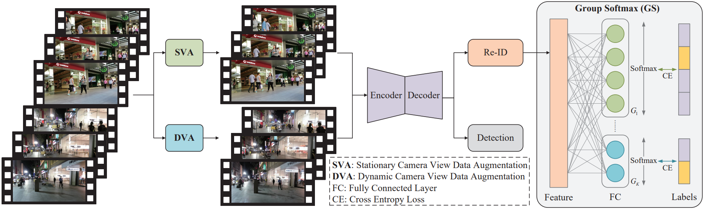

# Delving into the Trajectory Long-tail Distribution for Muti-object Tracking
This paper has been accepted by CVPR2024.

This paper is available at [https://arxiv.org/pdf/2403.04700.pdf](https://arxiv.org/pdf/2403.04700.pdf).

# Delving into the Trajectory Long-tail Distribution for Muti-object Tracking

This paper has been accepted by CVPR2024.

Phenomenon:

Pipeline:

> [**Delving into the Trajectory Long-tail Distribution for Muti-object Tracking**](http://arxiv.org/abs/2004.01888),            
> Sijia Chen, Yu En, Jinyang Li, Wenbing Tao, Wenyu Liu,        
> *CVPR2024 ([arXiv 2403.04700](http://arxiv.org/abs/2403.04700))*
## Abstract
Multiple Object Tracking (MOT) is a critical area within computer vision, with a broad spectrum of practical implementations. Current research has primarily focused on the development of tracking algorithms and enhancement of post-processing techniques. Yet, there has been a lack of thorough examination concerning the nature of tracking data it self. In this study, we pioneer an exploration into the distribution patterns of tracking data and identify a pronounced long-tail distribution issue within existing MOT datasets. We note a significant imbalance in the distribution of trajectory lengths across different pedestrians, a phenomenon we refer to as “pedestrians trajectory long-tail distribution”. Addressing this challenge, we introduce a bespoke strategy designed to mitigate the effects of this skewed distribution. Specifically, we propose two data augmentation strategies, including Stationary Camera View Data Augmentation (SVA) and Dynamic Camera View Data Augmentation (DVA) , designed for viewpoint states and the Group Softmax (GS) module for Re-ID. SVA is to backtrack and predict the pedestrian trajectory of tail classes, and DVA is to use diffusion model to change the background of the scene. GS divides the pedestrians into unrelated groups and performs softmax operation on each group individually. Our proposed strategies can be integrated into numerous existing tracking systems, and extensive experimentation validates the efficacy of our method in reducing the influence of long-tail distribution on multi-object tracking performance. 

The code will be updated soon.

